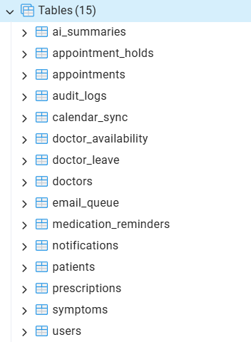

# Healthcare Appointment Manager - Server

This is the Node.js / Express backend for the Healthcare Appointment Manager.

## Database Schema

The database uses PostgreSQL and contains 15 core tables to manage users, doctors, appointments, AI summaries, and notifications.

## Features Implemented So Far

- **Database:** Full PostgreSQL schema with 15 core tables, utilizing DB-level unique constraints for concurrency protection.
- **Authentication API:** JWT-based login/registration with robust Role-Based Access Control (RBAC).
- **Doctor Management API:** Full CRUD operations for doctors, including dynamic availability scheduling and leave management.
- **Patient Management API:** Patient profiles with simulated medical history.
- **Advanced Appointment Engine:** Dynamic time-slot generation and secure booking engine. Features pessimistic locking (`SELECT ... FOR UPDATE`) for temporary slot holds to prevent race conditions, and atomic rescheduling.
- **Doctor Leave Handling:** Transactionally cancels affected appointments and queues notifications when a doctor goes on leave.
- **AI Integrations:** Robust multi-model LLM integration using `gemini-1.5-pro` (primary) and `gpt-4o` (fallback) to generate patient-friendly pre-visit and post-visit summaries.
- **Email Service & Queue:** Configured Nodemailer with customizable HTML templates, running on a PostgreSQL-backed asynchronous email queue with automatic retries and dead-letter handling.
- **Google Calendar Sync:** Implemented an OAuth 2.0 flow to seamlessly sync appointments, cancellations, and reschedules with user Google Calendars.
- **Medication Reminders:** Added structured prescription parsing and automatic calculation of medication dosage timings.
- **Background Job Runner:** Centralized `node-cron` workers to effortlessly manage the email queue, push medication reminders, and clean up abandoned appointment holds.

*Full API documentation and setup instructions will be added upon project completion.*
